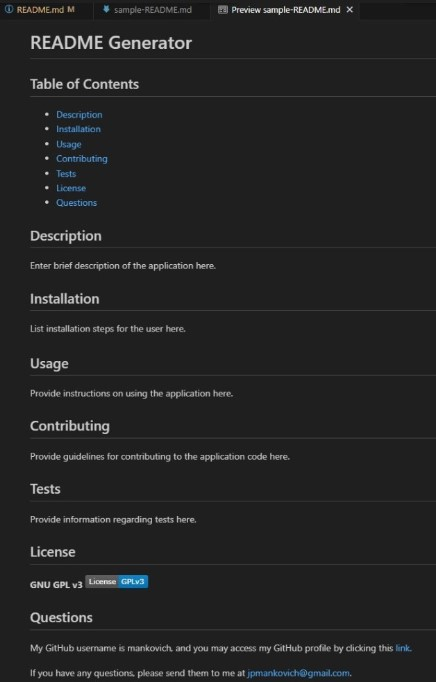

# Module 9 Challenge: README Generator

## Description

This is a command-line application that dynamically generates a professional README.md file based on a user's input obtained through a series of questions prompted using the Inquirer module. The application always a project creator to quickly and easily generate a README file for his or her project to inform potential users and other developers what the app is all about, how to install it and use it, how to make contributions, how to reach creator with any questions or issues, and other important information. 

## Application's Output: Sample README.md and Walkthrough Video

The following is a screenshot of the [sample README.md file](./submission-files/sample-README.md), which was generated using the application:

In addition, a video walking through the application's use and generation of that sample README may be accessed [here.](https://drive.google.com/file/d/1s7Z4R2pcwz3E0xDpTDzKK89U0bnwQSIj/view?usp=sharing)

## GitHub Repository

Finally, you may also visit my GitHub repository for the application [here.](https://github.com/mankovich/README-generator)

---

&copy;2024 Mankovich, a person. All rights reserved.